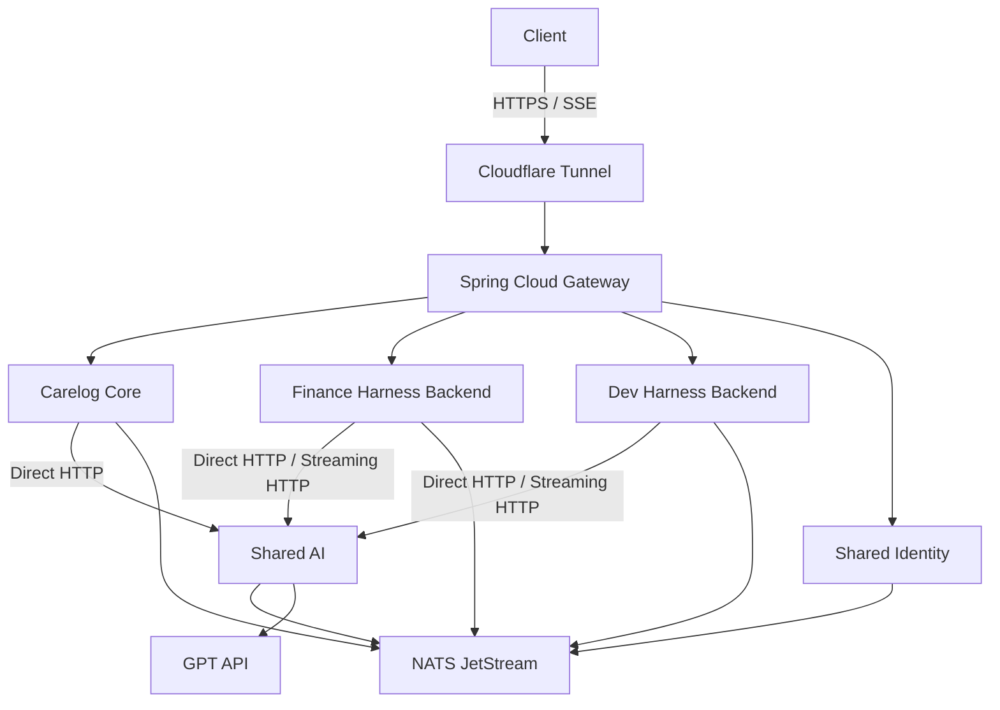
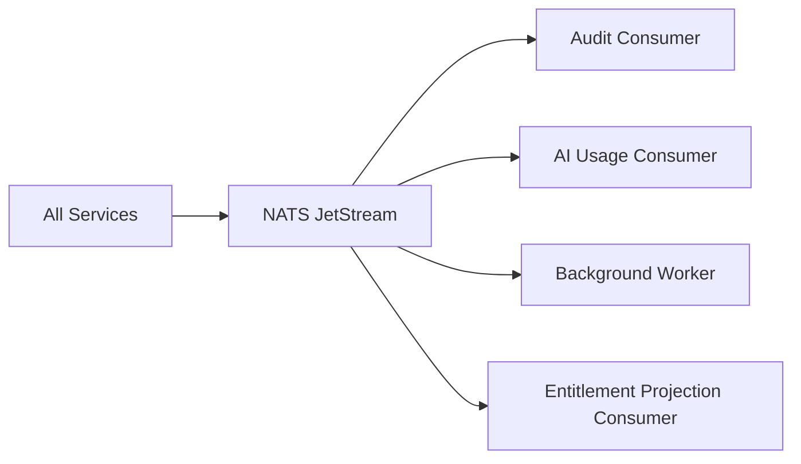

# Carelog·Finance Harness·Dev Harness 공통 MSA 플랫폼 설계

> **부제:** Shared Identity·Shared AI를 중심으로 한 서비스 경계, HTTP/SSE 통신, NATS JetStream 메시징, PostgreSQL·Redis 데이터 및 단일 Mac mini 운영 기준

> **Status:** Draft for Foundation Review
> **Scope:** Carelog, Finance Harness, Dev Harness, Shared Identity, Shared AI
> **Initial Runtime:** 단일 Mac mini M4
> **Primary AI Provider:** GPT API
> **Excluded by Default:** Kubernetes, system-wide gRPC, Kafka, Event Sourcing
> **Last Updated:** 2026-07-29

---

## 0. 문서 목적

이 문서는 다음 세 내부 세션에서 정리된 결론을 하나의 설계 기준으로 통합한다.

| 출처 | 역할 |
|---|---|
| 현재 세션 | 제품·서비스 책임 경계, 현재 구현 상태, 물리 배치 원칙 |
| 외부 세션 A — gRPC 검토 | 내부 동기 통신 프로토콜 선택 기준 |
| 외부 세션 B — MSA MQ 검토 | 비동기 메시징, 데이터 정합성, Outbox·멱등성 기준 |

여기서 **외부 세션**은 외부 인터넷 자료가 아니라, 현재 대화와 분리된 다른 내부 작업 세션을 의미한다.

이 문서의 목적은 다음과 같다.

1. 3개 제품과 공통 플랫폼의 책임을 고정한다.
2. HTTP, SSE, NATS JetStream의 사용 경계를 정한다.
3. gRPC, Kafka, Kubernetes의 도입 조건을 명시한다.
4. PostgreSQL·Redis·JetStream의 데이터 소유권을 분리한다.
5. 단일 Mac mini 환경에서 허용되는 운영 한계와 확장 기준을 정의한다.
6. 공통 서비스를 분리하되 분산 모놀리스가 되는 것을 방지한다.

---

## 1. 최종 결론

Carelog, Finance Harness, Dev Harness에서 반복되는 인증과 AI 실행 책임을 각각 `Shared Identity`, `Shared AI`로 분리한다.

각 제품은 자신의 도메인 정책과 데이터만 소유한다.

초기에는 비용과 운영 복잡도를 줄이기 위해 모든 서비스를 단일 Mac mini M4에서 독립 프로세스 또는 컨테이너로 운영한다.

기본 통신 방식은 다음과 같다.

| 통신 목적 | 현재 기본 선택 |
|---|---|
| 외부 API | HTTP/JSON |
| 내부 동기 호출 | HTTP/JSON |
| 브라우저 AI 응답 스트리밍 | SSE |
| 감사·후처리·상태 전파 | NATS JetStream |
| 비즈니스 데이터 원본 | PostgreSQL |
| 세션·캐시·단기 상태 | Redis |
| 고빈도 내부 RPC | 실제 병목 확인 후 일부 gRPC |
| CDC·장기 이벤트 플랫폼 | 실제 요구 발생 후 Kafka |

요약하면 다음과 같다.

```text
HTTP + SSE
= 사용자 요청과 즉시 응답이 필요한 동기 통신

NATS JetStream
= 비동기 이벤트, 후처리, 재시도, 단기·중기 재처리

PostgreSQL
= 비즈니스 데이터의 Source of Truth

Redis
= 세션, OAuth state, 캐시, Rate Limit, 단기 Blocklist

gRPC
= 성능 또는 엄격한 다중 언어 계약 필요가 측정된 일부 구간

Kafka
= CDC, 장기 Event Log, 대규모 Replay, 데이터 플랫폼 요구 발생 후
```

현재 단계에서 gRPC, Kafka, Kubernetes를 기본 인프라로 도입하지 않는다.

---


## 2. 초기 구상과 현재 확정안 비교

이 절은 과거 설계를 그대로 보존하기 위한 것이 아니라, 현재 구조가 어떤 문제를 제거하고 어떤 범위를 의도적으로 축소한 결과인지 설명한다.

### 2.1 한눈에 보는 변화

| 항목 | 초기 구상 | 현재 확정안 | 변경 이유 |
|---|---|---|---|
| 제품 범위 | Carelog 단일 CRM 중심 | Carelog·Finance Harness·Dev Harness 3개 독립 제품 | 실제 운영하려는 제품이 세 개로 확정됨 |
| MSA 목적 | 미래 확장성과 포트폴리오를 고려한 분리 검토 | 세 제품에서 반복되는 Identity·AI 책임을 한 번만 구현 | 추상적 확장성이 아니라 실제 복수 소비자가 생김 |
| Carelog 책임 | CRM·Auth·AI를 한 서버가 폭넓게 소유 | 고객·관계·기록·후속 관리 등 Carelog 도메인만 소유 | 제품 서비스가 공통 플랫폼 역할까지 떠안지 않도록 함 |
| 인증 구조 | `carelog-be` 내부 Auth와 CRM 사용자 모델 결합 | Shared Identity가 Account·OAuth·Token·Session 소유 | Finance·Dev Harness도 같은 인증 기반을 사용해야 함 |
| 인증 식별자 | `loginId` 중심 Principal과 JWT Subject | 안정적인 UUID `accountId` 중심 | OAuth 계정에 인위적인 `loginId`를 만들지 않기 위해 |
| 제품 인가 | 인증과 제품 권한이 섞일 가능성 | Identity는 신원, Product는 제품 내부 권한 판단 | Shared Identity의 God Service화를 방지 |
| AI Provider | Ollama·로컬 모델 중심 가능성 검토 | GPT API 기본, Ollama는 제한적 내부 보조 작업만 후속 검토 | 모델 운영보다 제품 로직과 사용 경험 구현이 우선 |
| AI 공통화 | Carelog 내부 AI 또는 제품별 AI Client | Shared AI가 Provider 호출·비용·재시도·관측을 공통 소유 | 동일한 실행 메커니즘의 반복 구현 제거 |
| AI 정책 | 공통 AI 서버가 Prompt와 정책까지 소유할 가능성 | 제품이 Prompt·Context·도메인 안전정책·결과 검증 소유 | Shared AI가 세 제품의 중앙 결합점이 되는 것을 방지 |
| 외부 진입 | EC2·Nginx·Cloudflare·온프레미스 조합 다수 검토 | Cloudflare Tunnel → Spring Cloud Gateway | Public Origin과 불필요한 Proxy 계층 제거 |
| 내부 호출 | Gateway가 내부 서비스 호출까지 중계할 가능성 | 서비스 간 Direct HTTP | 불필요한 Hop과 Gateway 장애 전파 방지 |
| 외부 API | REST 중심 | HTTP/JSON | 단순성과 도구 호환성 유지 |
| 내부 동기 통신 | gRPC를 공통 표준으로 도입할지 검토 | HTTP/JSON 기본, 측정된 병목 구간만 gRPC | 단일 장비·인스턴스 1개이며 GPT·DB 지연이 지배적 |
| AI Streaming | WebSocket·gRPC Streaming 등 복수 후보 | SSE | 단방향 Token Streaming에 가장 단순하고 적합 |
| 비동기 메시징 | RabbitMQ·Kafka·NATS 후보 비교 | 첫 실제 요구 발생 시 NATS JetStream | ACK·재전달·단기 Replay를 낮은 운영비로 충족 |
| Kafka | 미래 대규모 확장을 고려한 선도입 후보 | CDC·장기 Replay·데이터 플랫폼 요구 이후 검토 | 현재 요구에 비해 Broker·Partition 운영비가 큼 |
| 이벤트 정합성 | DB 처리 후 메시지 Publish 수준 | 중요 이벤트만 Transactional Outbox | Commit 이후 Publish 유실 방지 |
| Consumer | 정상 전달 중심 | At-least-once + Idempotent Consumer | 중복·재전달을 정상 운영 조건으로 수용 |
| MQ 데이터 역할 | 이벤트 저장소로 확대될 가능성 | 전달·재시도·단기 재처리 채널 | 비즈니스 원본은 PostgreSQL로 유지 |
| PostgreSQL | 서비스별 서버 또는 단일 DB 공유를 폭넓게 검토 | 인스턴스 1개, 서비스별 Schema/DB User/Migration 분리 | 비용을 줄이면서 데이터 소유권 유지 |
| Cross-schema 접근 | 물리 DB가 같으므로 직접 Join 가능성 | 타 서비스 Schema 직접 조회·Write·Join 금지 | 향후 물리 분리 가능성과 책임 경계 보존 |
| Redis | 인증·캐시·Rate Limit가 한 공간에 혼재 가능 | 인스턴스 1개, Prefix·ACL로 서비스별 격리 | 비용 최소화와 최소 권한을 동시에 확보 |
| Commerce | Identity·Commerce·Audit 동시 플랫폼화 검토 | 실제 결제·구독의 복수 소비가 생길 때 구축 | 사용처보다 플랫폼이 앞서는 과설계 방지 |
| Audit | 초기에 독립 동기 Audit Service 가능성 | 비동기 필요가 생길 때 JetStream Consumer로 시작 | Audit 장애가 제품 요청을 막지 않도록 함 |
| 배포 환경 | AWS·온프레미스·Kubernetes 등 다양한 후보 | 단일 Mac mini M4의 독립 프로세스·컨테이너 | 현재 비용과 1인 운영 관리 포인트 최소화 |
| Kubernetes | 서비스 수 증가를 이유로 초기 도입 가능성 | 다중 노드·Replica·무중단 운영이 실제 요구가 된 뒤 검토 | 단일 노드에서는 복잡도만 증가 |
| 고가용성 | MSA 분리로 장애 격리를 기대 | 프로세스 격리는 일부 가능, Mac 장애 시 전체 중단 | 논리 서비스 분리와 물리 HA를 명확히 구분 |
| 확장 방식 | 완성된 분산 플랫폼을 먼저 설계 | 부하가 생긴 서비스부터 복제·노드 분리 | 측정된 병목과 SLA에 따른 점진 확장 |
| 운영 원칙 | 사용할 수 있는 기술을 폭넓게 검토 | 관리 비용이 사용자 가치보다 크면 도입하지 않음 | 1인 개발·운영 환경의 지속 가능성 우선 |

### 2.2 구조 변화

#### 초기 구상

```text
Client
  ↓
Gateway
  ↓
Carelog Backend
  ├─ CRM
  ├─ Auth
  ├─ AI
  └─ 제품 정책

미래 후보
  ├─ EC2 / RDS
  ├─ Kubernetes
  ├─ Ollama
  ├─ gRPC
  ├─ Kafka 또는 기타 MQ
  └─ 다수 공통 서비스
```

초기에는 Carelog가 중심이었고, 향후 사용할 수 있는 기술과 배포 대안을 폭넓게 검토했다. 이 과정에서는 현재 구현, 미래 목표, 선택 가능한 기술 후보가 한 그림 안에 섞일 위험이 있었다.

#### 현재 확정안

```text
Client
  ↓ HTTP/JSON · SSE
Cloudflare Tunnel
  ↓
Spring Cloud Gateway
  ├─ Carelog Core
  ├─ Finance Harness Backend
  ├─ Dev Harness Backend
  └─ Shared Identity

Product Services
  ├─ Direct HTTP/SSE → Shared AI → GPT API
  └─ 필요 시 NATS JetStream → Async Consumer

PostgreSQL 1개
  └─ 서비스별 Schema·User·Migration·Ownership

Redis 1개
  └─ 서비스별 Prefix·ACL
```

현재는 실제 세 제품과 복수 소비가 확정된 공통 책임만 물리 서비스 후보로 둔다. 서비스 경계는 분리하지만, 서버·DB 인스턴스·오케스트레이션은 현재 규모에 맞게 최소화한다.

### 2.3 가장 중요한 변화 다섯 가지

| 초기 판단 | 현재 판단 |
|---|---|
| Carelog를 확장하며 필요한 기능을 계속 붙임 | 세 제품을 독립 제품으로 두고 공통 플랫폼만 공유 |
| 기술 후보를 먼저 넓게 검토 | 실제 문제와 측정된 요구가 생긴 기술만 도입 |
| Auth·AI를 각 제품이 직접 구현할 가능성 | Shared Identity·Shared AI에서 한 번만 구현 |
| MSA와 Kubernetes·다중 서버를 함께 고려 | 논리 서비스, 배포 단위, 물리 장비, HA를 별도 판단 |
| gRPC·Kafka를 미래 확장을 위해 선도입 검토 | HTTP·SSE로 시작하고 첫 비동기 요구에 JetStream 도입 |

### 2.4 유지한 원칙

- 제품별 도메인 데이터와 정책의 독립 소유
- 인증 신뢰 경계와 Gateway Header 위조 방어
- AI 장애가 제품 Core Workflow를 중단시키지 않는 구조
- 외부 공개 진입점과 내부 서비스 경계 분리
- 민감정보·Secret·Provider Token 비노출
- 향후 서비스별 독립 배포와 데이터 이전 가능성
- 실제 장애·부하·운영 증거에 따른 점진 확장

### 2.5 폐기하거나 보류한 방향

- Kubernetes 기본 도입
- Ollama를 핵심 AI Runtime으로 사용
- 모든 내부 호출의 gRPC 전환
- Kafka와 NATS의 동시 운영
- Gateway를 내부 호출 중계기로 사용
- 모든 서비스의 독립 DB 서버 선구축
- 모든 이벤트에 Transactional Outbox 적용
- 사용처가 없는 Shared Commerce·독립 Audit 플랫폼 선구축
- Shared AI에 제품별 Prompt·도메인 정책·저장 책임 집중
- MSA라는 이유만으로 물리 서버를 서비스별로 분리

### 2.6 현재 상태와 목표 상태의 표현 원칙

| 상태 | 의미 |
|---|---|
| Implemented | 현재 Repository에 코드가 있고 검증됨 |
| In Progress | Branch 또는 Draft PR에서 구현·검증 중 |
| Approved Target | 방향은 승인됐지만 아직 Runtime으로 존재하지 않음 |
| Deferred | Trigger가 생길 때까지 구현하지 않음 |
| Document Only | Migration·확장 후보로만 기록 |

현재 목표 아키텍처 전체를 구현 완료 상태로 표현하지 않는다.

---

## 3. 현재 구현 상태와 목표 상태

### 3.1 현재 실제 상태

```text
Client
  ↓
Spring Cloud Gateway
  ↓
carelog-be
  ├─ Auth/OAuth Module
  └─ Carelog CRM Core
```

현재 독립 실행 단위는 다음 두 개다.

- Spring Cloud Gateway
- `carelog-be`

현재 Auth/OAuth는 `carelog-be` 내부 모듈이다.

현재 완료 또는 진행 중인 인증 기반은 다음과 같다.

- `accountId` 기반 JWT subject
- Provider-neutral OAuth Core
- Kakao Provider Adapter
- Authorization / Exchange API
- Redis OAuth state 및 PKCE verifier
- Token blacklist
- Gateway OAuth 공개 경로
- Header 정규화와 Gateway Secret
- OAuth Rate Limit
- Gateway OAuth PR은 Draft 상태로 실제 E2E Gate가 남아 있음

현재 운영 중이라고 표현하면 안 되는 항목:

- 독립 Shared Identity Runtime
- Shared AI Runtime
- Finance Harness Backend
- Dev Harness Backend
- Shared Commerce
- 독립 Audit Platform

### 3.2 초기 목표 상태



Gateway는 제품 서비스가 아니라 공통 외부 진입·라우팅·기본 보안 계층이다.

---

## 4. 서비스별 책임

| 서비스 | 소유 책임 |
|---|---|
| Carelog Core | 고객, 관계, 기록, Timeline, Follow-up, Handoff |
| Finance Harness | 질문, Checklist, Journal, Review, 금융 정책 |
| Dev Harness | Task, Session, Handoff, Approval, AI 작업 제어 |
| Shared Identity | Account, OAuth, Token, Session, ExternalIdentity |
| Shared AI | AI Provider 호출, 모델 설정, 비용·사용량, 공통 실행 안전장치 |
| Shared Commerce | 상품, 구독, 결제, 공통 Entitlement |
| Audit | 공통 감사 이벤트 적재·조회 |

공통 서비스는 실행 메커니즘을 소유하고 제품 서비스는 도메인 의미와 정책을 소유한다.

```text
Shared Identity
= 사용자가 누구인가

Product Service
= 이 제품에서 무엇을 할 수 있는가

Shared Commerce
= 무엇을 구매했는가

Product Service
= 구매 결과로 어떤 기능을 사용할 수 있는가

Shared AI
= AI 요청을 어떻게 안전하고 경제적으로 실행하는가

Product Service
= AI가 해당 제품 도메인에서 무엇을 해야 하는가
```

---

## 5. 전체 요청 경로

### 5.1 외부 요청

```text
Client
  ↓
Cloudflare Tunnel
  ↓
Spring Cloud Gateway
  ↓
Product Service 또는 Shared Identity
```

### 5.2 내부 서비스 호출

내부 호출은 Gateway를 거치지 않는다.

```text
Carelog Core
  ↓ Direct HTTP
Shared AI
```

다음 구조는 사용하지 않는다.

```text
Carelog Core
  ↓
Gateway
  ↓
Shared AI
```

Gateway를 내부 호출 중계기로 사용하면 다음 문제가 생긴다.

- 불필요한 네트워크 홉
- Gateway 장애 영향 확대
- 외부 보안 정책과 내부 서비스 정책 혼합
- 추적과 오류 해석 복잡화
- 내부 서비스 간 결합 증가

---

## 6. 내부 동기 통신

### 6.1 기본 프로토콜

현재 내부 동기 통신은 HTTP/JSON을 기본으로 한다.

현재 조건:

- Kubernetes를 사용하지 않음
- 물리 서버는 Mac mini M4 한 대
- 서비스별 인스턴스는 초기 1개
- Spring 기반 서비스 비중이 높음
- 내부 네트워크 지연보다 GPT API·DB 처리 시간이 큼
- 개발·운영 복잡도가 성능보다 큰 제약

초기 프로토콜:

| 호출 경계 | 프로토콜 |
|---|---|
| Client → Gateway | HTTP/JSON |
| Gateway → Product | HTTP/JSON |
| Gateway → Shared Identity | HTTP/JSON |
| Product → Shared Identity | 제한적 HTTP/JSON |
| Product → Shared AI | HTTP/JSON 또는 Streaming HTTP |
| Product → Shared Commerce | 제한적 HTTP/JSON |
| AI Stream → Client | SSE |

Docker Compose 기준 내부 주소 예시:

```text
http://shared-identity:8080
http://shared-ai:8080
http://shared-commerce:8080
nats://nats:4222
```

### 6.2 제품별 Adapter

각 제품에는 얇은 Adapter를 둔다.

```text
Carelog Core
  ↓ IdentityClient
Shared Identity
```

Adapter 책임:

- API Client
- Timeout
- 제한적 Retry
- Circuit Breaker
- 오류 변환
- Correlation ID 전달
- 제품별 결과 해석

제품 도메인에서 Shared Service의 HTTP DTO나 오류 코드를 직접 확산시키지 않는다.

---

## 7. gRPC 보류 기준

현재 gRPC를 기본 통신 방식으로 채택하지 않는다.

gRPC 도입 시 추가되는 관리 비용:

- `.proto` 계약 관리
- Stub 코드 생성
- 빌드 파이프라인
- HTTP Gateway 연동
- 브라우저 직접 접근 제약
- Streaming 오류 처리
- Deadline·Status Code 변환
- 로깅과 디버깅 난이도
- 장기 연결과 Load Balancing 정책

현재 서비스당 인스턴스가 하나이므로 Kubernetes 환경에서 흔한 장기 연결 고착이나 Pod 불균형 문제는 사실상 없다.

그러나 gRPC의 성능상 이점도 작다.

```text
Product → Shared AI 내부 호출
= 수 ms 수준

Shared AI → GPT API
= 수백 ms ~ 수십 초
```

내부 HTTP를 gRPC로 바꿔 몇 ms를 줄여도 전체 AI 응답시간에는 거의 영향을 주지 않는다.

다음 조건이 실제로 발생할 때 일부 구간에만 도입한다.

- 내부 호출량이 초당 수천 건 이상
- JSON 직렬화가 실제 CPU 병목
- 대용량 Binary Payload 반복 전달
- 양방향 스트리밍이 핵심 기능
- Go와 Spring 사이 엄격한 Proto 계약이 필요
- 여러 언어 SDK 자동 생성이 필요
- 내부 p99 지연을 수 ms 단위로 줄여야 함

부분 도입 예시:

```text
Client → Gateway          HTTP
Gateway → Product         HTTP
Product → Identity        HTTP
Product → Shared AI       필요 시 gRPC
Audit / Async Event       NATS JetStream
```

---

## 8. AI 응답 스트리밍

실시간 AI 응답은 SSE를 사용한다.

```text
GPT API Stream
  ↓
Shared AI
  ↓ Streaming HTTP
Product Service
  ↓ SSE
Gateway
  ↓
Client
```

초기 Shared AI API 후보:

```text
POST /v1/ai/executions
POST /v1/ai/streams
GET  /v1/ai/executions/{executionId}
```

SSE 선택 이유:

- 브라우저와 모바일 웹에서 사용이 단순함
- 단방향 Token Streaming에 적합
- WebSocket보다 운영 복잡도가 낮음
- 일반 HTTP 인프라와 관측 도구 재사용 가능

WebSocket 검토 조건:

- 지속적인 양방향 메시지
- 실행 중 사용자 제어 메시지가 빈번함
- 실시간 협업 상태 동기화
- 하나의 연결에서 여러 실시간 이벤트를 다뤄야 함

---

## 9. Shared Identity 호출 기준

Shared Identity를 분리해도 모든 API 요청에서 동기 호출하면 안 된다.

### 9.1 비권장

```text
Client
  ↓
Gateway
  ↓
Carelog
  ↓ 매 요청
Shared Identity
```

이 구조는 Identity 장애가 모든 제품으로 전파되는 분산 모놀리스다.

### 9.2 현재 권장

```text
로그인·Refresh·계정 관리
Client
  ↓
Gateway
  ↓
Shared Identity

일반 API
Client
  ↓ Access Token
Gateway
  ↓ JWT 검증
Product Service
  ↓ 제품 인가
Product DB
```

현재 기준:

```text
Gateway
= JWT 서명·만료·Blacklist 검증
= 외부 X-User-* 제거
= 검증된 인증 Context Header 생성
= X-Gateway-Secret 주입

Product Service
= Gateway Secret과 인증 Context 검증
= 제품 내부 인가
```

제품 서비스가 Shared Identity를 호출하는 범위:

- 계정 상세 조회가 반드시 필요한 기능
- 관리자 계정 처리
- Provider Linking
- 계정 정지·탈퇴
- 프로필 수정
- 특수한 Introspection 요구

일반 요청에서는 Identity 호출을 하지 않는다.

향후 Gateway 우회 직접 호출이나 Zero Trust 내부망이 필요할 때 제품별 JWKS 검증을 추가 검토한다.

---

## 10. Shared Commerce 호출 기준

Shared Commerce도 모든 요청마다 호출하지 않는다.

### 10.1 비권장

```text
Finance API
  ↓
Finance
  ↓ 매 요청
Shared Commerce
```

### 10.2 초기

중요한 유료 기능 진입 시 조회하고 짧게 캐시한다.

```text
Finance
  ↓
Shared Commerce
  ↓
Entitlement Cache
```

### 10.3 확장

규모가 커지면 이벤트 기반 Projection으로 전환한다.

```text
Shared Commerce
  ↓ SubscriptionChanged
NATS JetStream
  ├─ Finance Entitlement Projection
  ├─ Carelog Entitlement Projection
  └─ Dev Harness Entitlement Projection
```

Shared Commerce는 구매·구독 상태의 Source of Truth다.

각 Product Service는 Entitlement를 실제 기능에 매핑한다.

---

## 11. Shared AI 책임 경계

### 11.1 Shared AI 소유

- OpenAI Client
- API Key와 Secret
- Model Alias
- Timeout
- Retry
- Rate Limit
- Token·비용 측정
- Provider 장애 처리
- 공통 Observability
- 기술적 Capability
- 공통 입력 크기 제한
- Provider 수준 안전장치

### 11.2 Product Service 소유

- 제품별 System Prompt
- Carelog 고객 Context 구성
- Finance 투자자문 위험 정책
- Dev Harness Approval 정책
- 제품별 Tool 정의
- AI 입력 데이터 선택
- 도메인 결과 검증
- AI 결과 저장·반영 조건

권장 흐름:

```text
Finance Harness
  ├─ 금융 정책 검증
  ├─ Lens 선택
  ├─ Prompt·Context 구성
  ↓
Shared AI
  ├─ Provider 선택
  ├─ Timeout / Retry
  ├─ GPT API 호출
  └─ 사용량 기록
  ↓
Finance Harness
  ├─ 결과 검증
  └─ Journal 반영
```

Shared AI가 제품별 정책과 저장 로직을 소유하면 중앙 결합점이 되므로 금지한다.

---

## 12. AI 동기 요청과 비동기 Job

### 12.1 동기·스트리밍

사용자가 즉시 결과를 기다리는 요청:

```text
Client
  ↓
Product
  ↓
Shared AI
  ↓
GPT API
  ↓ SSE
Client
```

### 12.2 비동기 Job

다음 작업은 비동기로 처리한다.

- 문서 대량 분석
- 주간 리포트 생성
- 장시간 Agent 실행
- 대량 Embedding
- 화면 종료 후에도 계속되어야 하는 작업
- 재시도 가능한 대규모 후처리

```text
Product Service
  ↓
AI Job 생성
  ↓
NATS JetStream
  ↓
Shared AI Worker
  ↓
Result 저장
  ↓
AiJobCompleted Event
```

---

## 13. NATS JetStream

비동기 통신은 NATS Core가 아니라 NATS JetStream을 사용한다.

```text
NATS Core
= 영속성 없는 저지연 Pub/Sub

NATS JetStream
= 저장, Durable Consumer, ACK, Redelivery, Replay
```

초기 사용 목적:

- Audit Event
- AI 사용량 기록
- 이메일·알림
- 장시간 AI Job
- 계정 상태 변경
- 구독·Entitlement 변경
- 결제 후속 처리
- 비동기 Projection 갱신



선택 이유:

- Consumer 일시 장애 동안 메시지 보존
- 실패 메시지 재전달
- 비동기 작업 처리
- 며칠 또는 수주 수준 재처리
- 낮은 운영 복잡도
- 단일 Mac mini 자원 제약
- Go와 Spring 지원
- Kafka 생태계 요구가 아직 없음

NATS는 첫 명확한 비동기 사용 사례가 생기는 시점에 도입한다.

인프라 구축 자체가 제품 기능보다 먼저 오지 않도록 한다.

---

## 14. Kafka 보류 기준

Kafka 강점:

- 대규모 분산 로그
- 수개월·수년 보관
- 다수 Consumer 독립 Replay
- CDC와 Debezium
- Kafka Connect
- 데이터웨어하우스·분석 파이프라인
- Partition 기반 병렬 처리
- Log Compaction
- Event Log 기반 상태 재구축

현재에는 불필요한 운영 부담:

- JVM Broker
- KRaft Controller
- Partition·Replication
- Consumer Group Rebalancing
- Segment·Log Cleaner
- 높은 메모리·Page Cache
- 추가 디스크 I/O
- 별도 관측·복구 지식

단일 Mac mini에서 Kafka RF=1이나 JetStream R1 모두 장비·SSD 전체 손실을 방어하지 못한다.

Kafka 재검토 조건:

- CDC
- 장기간 Audit 보존
- 여러 분석 시스템의 반복 Replay
- 검색·분석·웨어하우스 파이프라인
- 지속적 초당 수만~수십만 Event
- 이벤트 로그 자체가 독립 데이터 자산
- 물리 서버 3대 이상
- Kafka Connect·Kafka Streams 필요

---

## 15. JetStream 영속성

초기 구성:

```text
NATS Server: 1
JetStream Replica: 1
Storage: FileStorage
Data Path: Mac mini local SSD
Off-host Backup: 별도 장비 또는 Object Storage
```

동작:

```text
Publisher
  ↓
JetStream FileStorage
  ↓ Publish ACK
Durable Consumer
  ↓
DB 처리
  ↓
Consumer ACK
```

대응 가능한 장애:

- Consumer 재시작
- 서비스 재배포
- NATS 프로세스 재시작
- 일시적 처리 지연
- 짧은 Consumer 장애

대응 불가능한 장애:

- Mac mini 장비 고장
- SSD 고장
- 파일시스템 전체 손상
- 장비 분실
- 로컬 백업 동시 손실

원칙:

```text
PostgreSQL
= 비즈니스 Source of Truth

JetStream
= 이벤트 전달·재시도·단기 재처리 채널

Audit DB
= 감사 조회용 저장소
```

---

## 16. Transactional Outbox

DB Commit과 MQ Publish를 단순 연속 실행하면 이벤트가 유실될 수 있다.

```text
DB Commit 성공
  ↓
프로세스 종료
  ↓
NATS Publish 실패
```

유실되면 안 되는 이벤트는 Transactional Outbox를 사용한다.

```text
BEGIN
  도메인 데이터 변경
  Outbox Event 저장
COMMIT

Outbox Publisher
  ↓
JetStream Publish
  ↓ Publish ACK
  ↓
Outbox 발행 완료 처리
```

모든 이벤트에 Outbox를 강제하지 않는다.

| 이벤트 | 처리 방식 |
|---|---|
| 결제·환불 | Outbox 필수 |
| 계정 정지·탈퇴 | Outbox 권장 |
| 로그인 보안 이벤트 | 중요도에 따라 Outbox |
| AI 사용량·비용 | 과금 기준이면 Outbox 또는 동등 신뢰성 |
| 일반 조회 Audit | Best effort 가능 |
| Debug Trace | Best effort |
| 캐시 무효화 | 유실 허용 여부에 따라 |

---

## 17. Consumer 멱등성

JetStream 운영 가정:

```text
At-least-once Delivery
+ Idempotent Consumer
```

처리 흐름:

```text
메시지 수신
  ↓
eventId 확인
  ↓
이미 처리됐는지 조회
  ↓
비즈니스 처리
  ↓
processed_event 저장
  ↓
DB Commit
  ↓
JetStream ACK
```

DB 제약:

```sql
UNIQUE(event_id)
```

Consumer ACK는 DB Commit 이후에 수행한다.

DB Commit 전에 ACK하면 Consumer 장애 시 메시지는 제거됐지만 실제 처리는 실패할 수 있다.

---

## 18. Event Envelope 최소 계약

모든 비동기 이벤트는 최소한 다음 필드를 가진다.

```json
{
  "eventId": "uuid",
  "eventType": "identity.account.suspended.v1",
  "occurredAt": "2026-07-29T00:00:00Z",
  "producer": "shared-identity",
  "correlationId": "uuid",
  "causationId": "uuid-or-null",
  "aggregateType": "PlatformAccount",
  "aggregateId": "uuid",
  "schemaVersion": 1,
  "payload": {}
}
```

원칙:

- `eventId`는 전역 유일
- `eventType`에 버전 포함
- 민감 토큰과 Secret 포함 금지
- Payload는 소비자가 필요한 최소 정보만
- 이벤트로 다른 서비스의 내부 Entity를 노출하지 않음
- 역호환이 깨지면 새 이벤트 버전 사용

---

## 19. PostgreSQL 운영 원칙

초기에는 PostgreSQL 인스턴스 한 개를 사용한다.

```text
PostgreSQL Instance
  ├─ identity database/schema
  ├─ carelog database/schema
  ├─ finance database/schema
  ├─ dev_harness database/schema
  ├─ shared_ai database/schema
  └─ audit database/schema
```

최소 분리:

- 서비스별 DB User
- 서비스별 Schema 또는 Database
- 서비스별 Migration
- 서비스별 Connection Pool
- 데이터 소유권
- Backup·Restore 기준

금지:

```text
Finance SQL
  JOIN identity.accounts

Carelog
  직접 commerce.subscription 조회

Shared AI
  제품 DB 직접 조회·수정
```

서비스 간 데이터 전달:

- JWT Claim
- HTTP API
- NATS Event
- Local Projection

---

## 20. Redis 운영 원칙

초기에는 Redis 인스턴스 한 개를 사용한다.

현재 실제 Key 성격:

```text
request_rate_limiter.*
oauth:state:*
blacklist:*
```

향후 Namespace 예시:

```text
identity:session:...
identity:oauth:...
carelog:cache:...
finance:cache:...
devharness:cache:...
ai:rate-limit:...
commerce:entitlement:...
```

원칙:

- 서비스별 Prefix
- 가능하면 서비스별 ACL User
- 다른 서비스 Namespace 접근 금지
- 비즈니스 원본 저장 금지
- TTL과 최대 메모리 정책 명시
- Persistence가 필요한 보안 상태만 선별

Redis 저장 대상:

- Session
- OAuth State
- Cache
- Rate Limit
- 짧은 TTL Token Blocklist
- 임시 작업 상태

비즈니스 원본은 PostgreSQL이 소유한다.

---

## 21. 동기 호출 체인 제한

가장 큰 장애 위험은 프로토콜이 아니라 긴 동기 호출 체인이다.

비권장:

```text
Client
  ↓
Gateway
  ↓
Finance
  ↓
Identity
  ↓
Commerce
  ↓
Shared AI
  ↓
GPT API
```

권장:

```text
일반 API
Gateway
  ↓
Product
  ↓
Product DB

AI API
Gateway
  ↓
Product
  ↓
Shared AI
  ↓
GPT API

인증
Gateway
  ↓
JWT 로컬 검증

구독
Product
  ↓
Local Cache 또는 Projection

감사·후처리
Product
  ↓
NATS JetStream
```

원칙:

> 사용자 API 요청 하나당 필수 동기 Downstream은 가급적 하나 이하로 유지한다.

---

## 22. 단일 Mac mini 장애 경계

현재 구조는 논리적 MSA지만 물리적 고가용성 구조가 아니다.

```text
Mac mini 장애
  ↓
Gateway
Identity
Carelog
Finance
Dev Harness
Shared AI
NATS
PostgreSQL
Redis
전체 중단
```

현재 가능한 것:

| 항목 | 가능 여부 |
|---|---|
| 코드 경계 분리 | 가능 |
| 데이터 소유권 분리 | 가능 |
| 서비스별 배포 | 가능 |
| 프로세스 장애 격리 | 일부 가능 |
| 물리 장애 격리 | 불가능 |
| 고가용성 | 없음 |
| 자동 수평 확장 | 없음 |

MVP·Pilot 단계에서 이 제약을 명시적으로 수용한다.

최소 운영 요건:

- PostgreSQL off-host backup
- 중요 JetStream 데이터 off-host backup
- Secret·설정 backup
- 프로세스 또는 컨테이너 자동 재시작
- Mac 재부팅 후 자동 기동
- Health Check
- 디스크 용량 경고
- PostgreSQL Connection Pool 모니터링
- NATS Consumer Lag 모니터링
- Cloudflare Tunnel 자동 재연결
- 원격 복구 수단
- UPS 검토

같은 Mac 내부 디스크만 사용하는 백업은 장애 대비 백업으로 보지 않는다.

---

## 23. 초기 물리 배치

```text
Mac mini M4
├─ cloudflared
├─ Spring Cloud Gateway
├─ Shared Identity
├─ Carelog Core
├─ Finance Harness Backend
├─ Dev Harness Backend
├─ Shared AI
├─ Audit Consumer
├─ NATS JetStream
├─ PostgreSQL
└─ Redis
```

초기에는 아직 존재하지 않는 서비스를 모두 동시에 올리는 것이 아니라, 구현 순서에 따라 추가한다.

```text
논리 서비스 분리
= 코드, 배포, 데이터 소유권, 책임 경계 분리

물리 장비 분리
= 실제 부하·SLA·복구 요구가 생긴 뒤
```

동일 장비 배치는 MSA와 모순되지 않는다.

---

## 24. 확장 단계

### 24.1 1단계 — 현재

- 단일 Mac mini
- Docker Compose
- 서비스당 인스턴스 1개
- HTTP 내부 통신
- SSE AI Streaming
- 필요 시 NATS JetStream
- PostgreSQL 1개
- Redis 1개

### 24.2 2단계 — 특정 서비스 복제

예: Shared AI 부하 증가

```text
Product Services
  ↓
Internal Reverse Proxy
  ├─ Shared AI 1
  ├─ Shared AI 2
  └─ Shared AI 3
```

HTTP면 내부 Reverse Proxy 또는 Service Discovery로 분산한다.

gRPC 도입 시 추가 검토:

- Envoy L7 Load Balancing
- Client-side round_robin
- Headless DNS
- 다중 Channel
- max connection age

### 24.3 3단계 — 물리 노드 분리

```text
Public Node
  └─ Gateway

Product Node
  ├─ Carelog
  ├─ Finance
  └─ Dev Harness

Shared Node
  ├─ Identity
  ├─ Shared AI
  └─ Commerce

Data Node
  ├─ PostgreSQL
  ├─ Redis
  └─ NATS
```

### 24.4 4단계 — 오케스트레이션

Kubernetes 또는 대체 오케스트레이터 검토 조건:

- 여러 물리 노드
- 서비스별 Replica 자동 조절
- 무중단 배포
- 자동 장애 복구
- 운영자 다수
- 배포 빈도 증가
- 서비스 수 지속 증가
- Docker Compose 운영이 실제 병목

서비스가 여러 개라는 이유만으로 Kubernetes를 도입하지 않는다.

---

## 25. 구현 우선순위

### P0 — 인증과 첫 제품 연결

1. Shared Identity 분리 완성
2. Gateway 인증 Context 계약 고정
3. Carelog Core와 Shared Identity 연결
4. HTTP Client 공통 운영 기준
   - Timeout
   - Retry 제한
   - Circuit Breaker
   - Error Mapping
   - Correlation ID
5. Frontend Callback과 Live OAuth E2E
6. Redis 장애와 Gateway Rate Limit 실제 검증

### P1 — Shared AI와 첫 실제 소비

7. Shared AI 구축
8. Carelog의 첫 AI 흐름 연결
9. SSE Streaming 계약 검증
10. 사용량·비용 측정
11. Finance Harness Backend 연결

### P2 — 첫 실제 비동기 요구

12. NATS JetStream 단일 노드 구성
13. Event Envelope 확정
14. 멱등 Consumer 구현
15. 중요한 이벤트에 Transactional Outbox
16. Audit Consumer 또는 AI Usage Consumer

### 후속

17. Dev Harness Backend 연결
18. 실제 결제 도입 시 Shared Commerce
19. Entitlement Projection
20. 부하·SLA에 따른 물리 노드 분리
21. 측정 결과에 따른 일부 gRPC
22. CDC·장기 Event Log 필요 시 Kafka
23. Compose가 병목일 때 Kubernetes

---

## 26. 현재 하지 않을 범위

다음은 현재 단계에서 과설계로 분류한다.

- 모든 내부 통신의 gRPC 전환
- Kafka와 NATS 병행 운영
- Kubernetes 도입
- 서비스별 PostgreSQL 서버 생성
- 동일 Mac에서 NATS Replica 3개
- Identity 매 요청 동기 조회
- Commerce 매 요청 동기 조회
- Gateway를 내부 호출 중계기로 사용
- 모든 이벤트에 Outbox 강제
- Shared AI에 제품 정책 집중
- 제품 간 Cross-schema Join
- 전역 분산 트랜잭션
- 전면 Event Sourcing
- 필요 없는 장기 Event Log
- 모든 서비스를 한 번에 물리 분리
- Ollama를 핵심 AI Runtime으로 채택

Ollama는 향후 내부 소규모 보조 작업에 한해 별도로 검토할 수 있으나 현재 기준 Provider는 GPT API다.

---

## 27. 핵심 불변조건

1. Identity와 Commerce를 매 요청마다 동기 호출하지 않는다.
2. 한 요청에 긴 서비스 호출 체인을 만들지 않는다.
3. 사용자 API 요청의 필수 동기 Downstream은 가급적 하나 이하로 유지한다.
4. 단일 PostgreSQL에서도 서비스별 데이터 소유권을 지킨다.
5. Product Service는 다른 서비스 Schema를 직접 조회하거나 수정하지 않는다.
6. Shared AI는 제품별 정책과 제품 DB를 소유하지 않는다.
7. 유실되면 안 되는 Event만 Outbox를 사용한다.
8. Consumer는 At-least-once와 중복 전달을 전제로 멱등하게 구현한다.
9. MQ를 비즈니스 Source of Truth로 사용하지 않는다.
10. 논리 서비스 분리와 물리 장비 분리를 혼동하지 않는다.
11. Kubernetes, gRPC, Kafka는 실제 측정된 요구가 생긴 뒤 도입한다.
12. 현재 구현 상태와 목표 아키텍처를 외부 문서에서 구분한다.

---

## 28. 결정 요약

| 항목 | 결정 |
|---|---|
| 제품 서비스 | Carelog, Finance Harness, Dev Harness |
| 공통 플랫폼 | Shared Identity, Shared AI |
| 후속 공통 플랫폼 | Shared Commerce, Audit |
| 외부 진입 | Cloudflare Tunnel + Spring Cloud Gateway |
| 내부 동기 통신 | HTTP/JSON |
| AI Streaming | SSE |
| 비동기 메시징 | 실제 요구 발생 시 NATS JetStream |
| Business SSOT | PostgreSQL |
| Cache·Session | Redis |
| 기본 AI Provider | GPT API |
| 로컬 보조 모델 | Ollama는 제한적 후속 검토 |
| gRPC | 기본 보류, 일부 구간 조건부 |
| Kafka | CDC·장기 Replay·데이터 플랫폼 요구 후 |
| Kubernetes | 다중 노드·Replica·운영 병목 후 |
| 초기 배포 | 단일 Mac mini M4 |
| HA | 현재 없음 |
| 데이터 분리 | Schema/DB User/Migration/Ownership 분리 |
| Auth 검증 | Gateway JWT 검증 + Product 인증 Context 검증 |
| Identity 호출 | 로그인·관리 흐름에 한정 |
| Commerce 호출 | 중요 진입점 조회·Cache, 이후 Projection |
| Outbox | 중요 이벤트에 선택 적용 |
| Consumer | At-least-once + Idempotency |

---

## 29. 남은 결정

다음 항목은 구현 전에 별도 Decision 또는 ADR이 필요하다.

1. PostgreSQL을 서비스별 Schema로 나눌지 Database로 나눌지
2. Shared Identity 독립 Repository와 Migration 소유권
3. Access·Refresh Token 전달과 Web·Capacitor 저장 전략
4. Gateway Header Context의 정확한 필드와 버전
5. Shared AI API 계약과 Streaming 오류 형식
6. Event Envelope의 공통 Package 제공 여부
7. NATS 첫 실제 Use Case
8. Outbox Publisher 실행 방식
9. Audit 보존 기간
10. Off-host Backup 대상과 Restore Drill 주기
11. Shared Commerce 도입 Trigger
12. JWT/JWKS의 Product 독립 검증 도입 Trigger

---

## 30. 최종 판정

이 구조는 MSA를 위한 MSA가 아니다.

Carelog, Finance Harness, Dev Harness라는 실제 세 제품에서 반복되는 인증과 AI 실행 책임을 공통 서비스로 추출하고, 각 제품은 자신의 도메인 정책과 데이터만 소유한다.

현재는 비용과 관리 복잡도를 줄이기 위해 동일 Mac mini에서 독립 배포 단위로 실행한다.

통신은 다음 기준으로 시작한다.

```text
동기 API
= HTTP/JSON

AI Streaming
= SSE

비동기 Event
= NATS JetStream

비즈니스 원본
= PostgreSQL

단기 상태
= Redis
```

gRPC는 고빈도 내부 통신이나 엄격한 다중 언어 계약의 필요가 측정된 뒤 일부 구간에 도입한다.

Kafka는 CDC, 장기 Event Log, 대규모 Replay, 데이터 분석 플랫폼이 실제 요구사항이 된 뒤 도입한다.

현재 성공 조건은 서비스 개수나 프로토콜 성능이 아니라 다음 네 가지다.

1. 공통 서비스를 매 요청 동기 의존성으로 만들지 않는다.
2. 긴 동기 호출 체인을 방지한다.
3. 단일 데이터 인스턴스에서도 소유권 경계를 지킨다.
4. 중요한 이벤트만 Outbox와 멱등 Consumer로 안전하게 처리한다.
